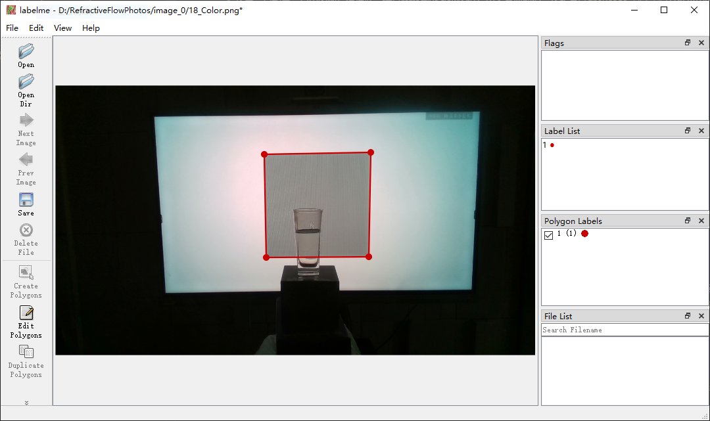

# 标注真实折射物体的refractive flow

## 环境

```
conda create -n labelme python=3.6
conda activate labelme
pip install -i https://mirrors.aliyun.com/pypi/simple -r requirements.txt
```

## 数据采集
首先，需要在数据采集室中，将相机视角固定，拍摄一组图片（拍摄的相机不限，最好使用realsenseD435，但分辨率最好大于512*512）。拍摄的这组图片包括下列信息。
1. RGB背景图片，无透明物体。
2. 放置好透明物体（从此开始，该透明物体要保持不动），以RGB背景图片为背景拍摄。
3. 更换背景为`graycode_512_512`文件夹中的图片（从graycode_0.png到graycode_18.png）各拍一张，共19张照片。拍摄中应尽可能使背景中的graycode是正方形，且水平。图片应分别命名为0_Color.png, 1_Color.png, ..., 18_Color.png。
4. 将第一点和第二点中的图片保存好，计算refractive flow的过程中不需要他们。将所有以`graycode_512_512`文件夹中的图片为背景拍摄得到的照片，单独放置在一个文件夹中（如`image_0`，以下所有脚本都将默认文件夹名为`image_0`），再将这个文件夹放置在当前路径下。此时，当前路径下的文件树为

```
├─image_0
│ ├─0_Color.png
│ ├─1_Color.png
│ ├─...
│ └─18_Color.png
├─graycode_512_512
│ ├─graycode_0.png
│ ├─graycode_1.png
│ ├─...
│ └─graycode_18.png
├─data_annotator.py
├─generate_refractive_flow.py
├─README.md
├─render_utils.py
├─requirements.txt
└─...
```

## Refractive_flow的生成

### 裁剪出graycode区域
在这个环节中，我们需要手动标出裁剪区域。裁剪区域应尽可能是一个正方形。这里只需要挑选一张照片去标即可，因为在所有照片中相机视角是固定的，因此标出这个区域即可适用于所有照片的裁剪。这里我们建议选择一张可以清晰看出背景图片边界的照片用来裁剪（如`18_Color.png`）。

在命令行中使用命令
```
labelme
```
即可调出`labelme`的GUI界面，点击左上角`File`-`Open`，找到之前选择的那张照片并打开。点击左侧菜单栏中的`Create Polygons`，然后选择背景graycode的边界，**按照左上-左下-右下-右上的顺序点击四角**，连成一个四边形。在弹出的框中，随意填写，比如都写1，点击OK即可。此时界面应如下图所示。



点击左侧的`Save`，将结果保存在`image_0`文件夹中，并将其命名为`crop.json`。接下来，运行脚本

```
python data_annotator.py 1 \
    --image_dir image_0 --crop_dir crop_imgs --crop_json crop.json
```

即可在`image_0/crop_imgs/`文件夹下得到裁剪出的graycode区域，并且已经resize到512x512分辨率。

### 为裁剪出的graycode区域标mask

在这个环节中，需要从刚才生成的graycode中任选一张图片，手动标出透明物体的mask。标注方式与之前相同，但这次的mask不限制是四个点，也不限制标注顺序，也不限制mask数量，只要将所有视野内的透明物体都标出即可。然后将标注信息保存在`image_0`文件夹中，命名为`mask.json`。

### 将裁剪出的graycode区域二值化，生成规范graycode

运行脚本

```
python data_annotator.py 2 \
    --image_dir image_0 --crop_dir crop_imgs \
    --graycode_dir graycode_imgs --mask_json mask.json
```

即可在`image_0/graycode_imgs`中生成规范的graycode，便于下一步计算refractive flow。

### 根据规范graycode生成refractive flow

运行脚本
```
python generate_refractive_flow.py --in_root image_0 --in_dir graycode_imgs
```

即可在`image_0/refractive_flow`文件夹中生成refractive flow。
